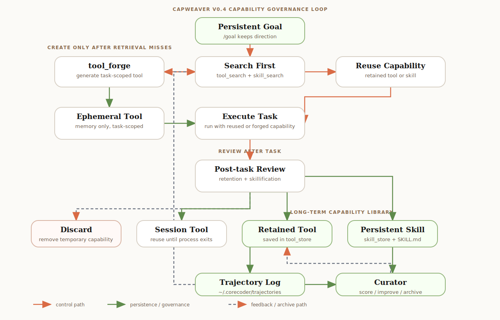

# CapWeaver

CapWeaver 是一个围绕“能力增长”设计的轻量级 Coding Agent 项目。

它以 [CoreCoder](https://github.com/he-yufeng/CoreCoder) 的紧凑架构为基础，在上面补齐了一条更明确的能力生命周期：

- 优先检索可复用的 retained tool 或 workflow skill
- 检索未命中时才动态生成临时 tool
- 先完成当前任务
- 任务结束后再决定丢弃、保留到当前会话、保存为 retained tool，或进一步包装成 skill

当前公开版本：**v0.2.0**

## 这个项目想解决什么

很多 Coding Agent 可以完成一次任务，但很难把这次执行过程沉淀成后续可复用的能力。CapWeaver 想探索的是一条更明确的路线：

**把一次性执行，变成受控的能力形成过程。**

## 生命周期



当前主链路可以概括为：

`tool_search / skill_search -> tool_forge -> ephemeral -> session / retained -> optional skillification -> persistent skill`

也就是说：

- 命中已有 retained tool 或 skill 时直接复用
- 未命中时才生成任务级临时 tool
- 先完成任务，再做留存判断
- 最终进入丢弃、会话保留、retained tool 或 workflow skill

## 核心思路

| 阶段 | 作用 |
|---|---|
| `tool_search / skill_search` | 优先复用 retained tool 或 workflow skill |
| `tool_forge` | 检索失败时再生成新工具 |
| `ephemeral` | 当前任务可用的临时工具 |
| `session` | 当前运行会话内可继续复用 |
| `retained` | 保存到 `tool_store` 的执行层工具 |
| `skillification` | 把 retained tool 或可复用流程包装成 skill |
| `persistent skill` | 保存到 `skill_store` 的 workflow 能力 |

## v0.2 更新

| 方向 | v0.1 | v0.2 |
|---|---|---|
| 持久化模型 | 主要是 `session -> skill` | `session -> retained`，并可选 `skillification` |
| 检索路径 | 以 skill 为主 | 分离 `tool_search` 与 `skill_search` |
| skill 来源 | 偏工具驱动 | retained-tool + workflow-first |
| 可观测性 | 基础生命周期 | telemetry + `/capstats` |
| 交互命令 | `/tools`、`/skills` | `/tools`、`/retained`、`/skills`、`/capstats` |

## 仓库结构

```text
.
├─ CoreCoder/
│  ├─ corecoder/
│  ├─ tests/
│  ├─ README.md
│  ├─ README_CN.md
│  └─ pyproject.toml
├─ run_local_corecoder.ps1
├─ README.md
└─ README_CN.md
```

主要代码位于 `CoreCoder/` 目录下。

## 快速开始

你可以使用本地环境变量，或者自己维护一个本地 `.env`：

```powershell
$env:OPENAI_API_KEY="your-api-key"
$env:OPENAI_BASE_URL="https://your-openai-compatible-endpoint/v1"
./run_local_corecoder.ps1 -Model "your-model-name"
```

或者进入包目录直接运行：

```powershell
cd CoreCoder
python -m corecoder -m your-model-name
```

## 常用命令

```text
/help       查看帮助
/tools      查看当前已加载工具
/retained   查看已保存 retained tool
/skills     查看已保存 skill
/capstats   查看能力增长统计
/save       保存会话历史
/sessions   查看已保存会话
/reset      重置当前对话
```

## 引用与致谢

这个项目**基于并参考了** [CoreCoder](https://github.com/he-yufeng/CoreCoder)。

CapWeaver 保留了 CoreCoder 作为极简 Agent 骨架的核心价值，并在其基础上继续扩展了：

- retained tool 检索
- workflow skill 检索
- 动态 tool forging
- capability retention
- workflow skillification
- 受保护的持久化

如果你想先理解原始极简架构，可以优先阅读：

- `CoreCoder/README.md`
- `CoreCoder/README_CN.md`

## 说明

- `session` 工具只在当前运行进程里有效。
- retained tool 与 workflow skill 分开存储。
- `/save` 目前保存的是对话历史，不会把内存中的 session tool 一起持久化。
- 为了兼容上游结构，当前运行时包名和 CLI 入口仍然保留为 `corecoder`。

## License

MIT
